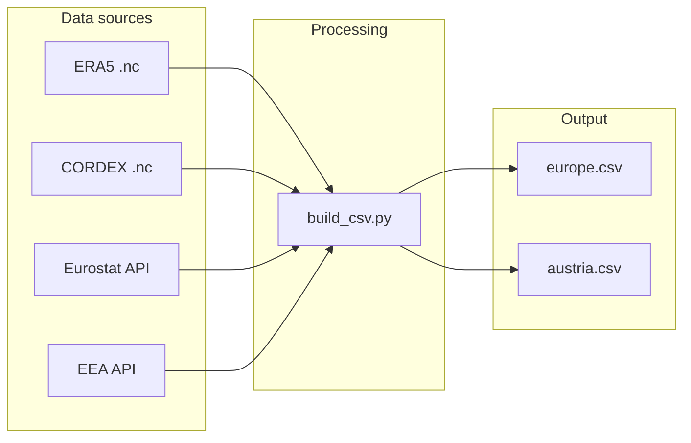

# Pipeline Details

This document explains (step by step) how raw external datasets are ingested,
processed, and merged into the weekly tables (`europe.csv`, `austria.csv`)
consumed by the modelling code and the Flask dashboard.

---

## 0. Quick build commands

```bash
# generate region centroids and GeoJSON
python scripts/build_geojson.py

# pull every external feed, run all transforms,
# and write europe.csv / austria.csv under data/processed/
python scripts/build_csv.py
```

> **Note** Only CORDEX NetCDF files must be downloaded manually (see section 2).

---

## 1. Folder layout (relative to repo root)

```plaintext
data/
├─ era5_land/          # monthly ERA5-Land .nc  (21 GB for 2000-2025)
├─ rcp45/              # CORDEX RCP4.5 .nc  (downloaded via wget)
├─ rcp85/              # CORDEX RCP8.5 .nc  (downloaded via wget)
├─ europe.csv          # weekly feature table (country-level)
└─ austria.csv         # weekly feature table (NUTS-3 level)
```

All scripts write inside `data/`; nothing is stored outside the repository.

---

## 2. Data sources and ingestion

| Source           | Script(s)                                                    | Raw data                    | Coverage       | Notes                              |
| ---------------- | ------------------------------------------------------------ | --------------------------- | -------------- | ---------------------------------- |
| **ERA5-Land**    | `scripts/era5.py`                                            | hourly NetCDF (`t2m`, `tp`) | 2000 - present | 0.25° grid; \~21 GB so far         |
| **CORDEX**       | `data/rcp45/wget.sh`, `data/rcp85/wget.sh`, `ccee/cordex.py` | monthly NetCDF (`tas`)      | 1971-2100      | EUR-11 domain (0.25°)              |
| **Eurostat API** | `ccee/eurostat.py` (called by `build_csv.py`)                | JSON - CSV                  | varies         | Population, density, weekly deaths |
| **EEA API**      | `ccee/eea.py` (called by `build_csv.py`)                     | hourly gridded CSV          | 2013 - present | O₃, NOₓ, PM₁₀                      |

### 2.1 ERA5 - Land Reanalysis Data

> Source: [Copernicus Climate Data Store](https://cds.climate.copernicus.eu/datasets/reanalysis-era5-land?tab=overview)

How to **authorize** the execution of the Python code on Windows? Follow <https://cds.climate.copernicus.eu/how-to-api> (only once)

- If you do not have an account, please register on the CDS registration page.
- Log in.
- Copy the code with your personal key into the file "USER/.cdsapirc" (in Windows environment)
  > The file starting with a dot can be created using Notepad: File > Save as > Type: All files > File name: .cdsfapirc

Once you have completed the steps above, the ERA5 data can be downloaded using the functions inside `ccee/era5.py`. This script downloads **one NetCDF per month** into `data/era5_land/`. It is recommended that you execute this script before the first run of `build_csv.py` to ensure that all required data is available.

`ccee/era5.py` (triggered by `build_csv.py`):

- converts Kelvin - °C,
- samples each region centroid,
- aggregates **hourly - weekly** and outputs three columns:

| Column          | Definition                                            | Units |
| --------------- | ----------------------------------------------------- | ----- |
| `temp_era5_q05` | 5-th percentile of hourly temperature within the week | °C    |
| `temp_era5_q50` | Median weekly temperature                             | °C    |
| `temp_era5_q95` | 95-th percentile                                      | °C    |

### 2.2 CORDEX - CMIP (Climate Projections)

> Source: [ESGF Data Browser (LiU Node)](https://esg-dn1.nsc.liu.se/search/esgf-liu/)

Before running `scripts/build_csv.py` you will need to have the CORDEX data downloaded. This is done via a WGET script that you can generate from the ESGF Data Browser.

Official tutorial link: <https://cordex.org/wp-content/uploads/2023/08/How-to-download-CORDEX-data-from-the-ESGF.pdf>

**Step-by-step**:

1. Register to access the ESGF data.
2. Search with the following filters:
   - **Project**: CORDEX
   - **Experiment**: rcp85 OR rcp45
   - **Variable**: tas (air temperature)
   - **Domain**: EUR-11
   - **Time Frequency**: mon
3. Select a dataset, e.g.:

   ```plaintext
   cordex.output.EUR-11.SMHI.MPI-M-MPI-ESM-LR.rcp85.r2i1p1.RCA4.v1.mon.tas
   ```

4. Download the WGET script and run:

```bash
bash ./data/wget-YYYYMMDDHHMMSS.sh -H
```

**Tip**: You will need a Linux-based system (e.g., Ubuntu) to execute WGET scripts.

`ccee/cordex.py` (triggered by `build_csv.py`):

- converts Kelvin - °C,
- samples each region centroid,
- interpolates **monthly - weekly** and outputs two columns:

| Column       | Definition                                    | Units |
| ------------ | --------------------------------------------- | ----- |
| `temp_rcp45` | Median weekly temperature for RCP4.5 scenario | °C    |
| `temp_rcp85` | Median weekly temperature for RCP8.5 scenario | °C    |

### 2.3 Eurostat - Population and Mortality

> Source: [Eurostat](https://ec.europa.eu/eurostat/web/health/database)

The original Eurostat data is pulled via the API. The raw data is as follows:

| Variable             | Eurostat ID                                        | Units        | Time step | Region level     |
| -------------------- | -------------------------------------------------- | ------------ | --------- | ---------------- |
| `population_density` | `demo_r_d3dens`                                    | people / km2 | yearly    | NUTS-3           |
| `population`         | `tps00001` (country) + `demo_r_pjanaggr3` (NUTS-3) | people       | yearly    | NUTS-3 / country |
| `mortality`          | `demo_r_mwk3_t`                                    | deaths       | weekly    | NUTS-3 / country |

_Missing population_ (pre-2014 NUTS-3) is imputed as
`population_density` $\times$ `area_km2`.

`mortality_rate` is then
`mortality / population` $\times$ 100,000 (deaths per 100,000 people).

The output of `ccee/eurostat.py` (triggered by `build_csv.py`) is a DataFrame
with the following columns:

| Column               | Definition                  | Units                   |
| -------------------- | --------------------------- | ----------------------- |
| `population`         | Total population in region  | people                  |
| `population_density` | People per square kilometer | people / km2            |
| `mortality`          | Total deaths in region      | deaths                  |
| `mortality_rate`     | Deaths per 100,000 people   | deaths / 100,000 people |

### 2.4 European Environment Agency (EEA)

> Source: [European Air Quality Portal](https://aqportal.discomap.eea.europa.eu/download-data/)

Hourly gridded fields (0.25°) are averaged over each region and then over
each week to produce:

| Column | Definition            | Units                  |
| ------ | --------------------- | ---------------------- |
| `O3`   | Ozone                 | $\mu \text{g}\ m^{-3}$ |
| `NOx`  | Nitrogen oxides       | $\mu \text{g}\ m^{-3}$ |
| `pm10` | Particulate matter 10 | $\mu \text{g}\ m^{-3}$ |

---

## 3. Processing chain (`scripts/build_csv.py`)



1. Load centroids from `regions.geojson`.
2. Call each `ccee/*` module to obtain a weekly DataFrame.
3. Outer-join on (`NUTS_ID`, `year`, `week`).
4. Write two CSVs:

| File                             | Level   | Rows (2025) | Size  |
| -------------------------------- | ------- | ----------- | ----- |
| `data/processed/csv/europe.csv`  | country | \~350 000   | 10 MB |
| `data/processed/csv/austria.csv` | NUTS-3  | \~200 000   | 7 MB  |

---

## 4. Variables in final CSV

| Group                      | Columns                                                           |
| -------------------------- | ----------------------------------------------------------------- |
| **Keys**                   | `NUTS_ID`, `year`, `week`                                         |
| **ERA5 quantiles**         | `temp_era5_q05`, `temp_era5_q50`, `temp_era5_q95`                 |
| **CORDEX**                 | `temp_rcp45`, `temp_rcp85`                                        |
| **Population / mortality** | `population`, `population_density`, `mortality`, `mortality_rate` |
| **Air-quality**            | `O3`, `NOx`, `pm10`                                               |

---

## 5. Update cadence

| Task                             | Frequency      |
| -------------------------------- | -------------- |
| Download new ERA5 month          | monthly (cron) |
| Refresh Eurostat & EEA API pulls | yearly         |
| Re-run `build_csv.py`            | monthly        |

---
