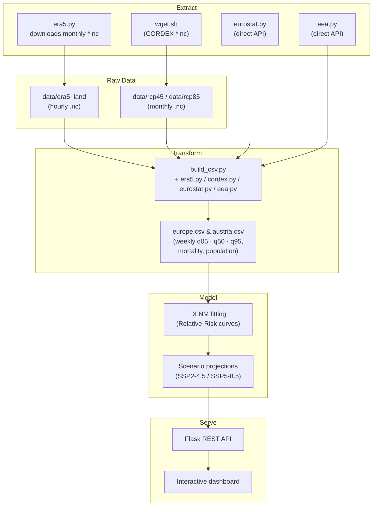

# Data-Pipeline Overview

This document summarises how external datasets flow through the repository
—from raw downloads in `data/` to the analysis products served by the Flask
application.

---

## 1 . High-level diagram



---

## 2 . Stage descriptions

| Stage           | Folder(s) in repo                                                                                                    | Main tools                                 |
| --------------- | -------------------------------------------------------------------------------------------------------------------- | ------------------------------------------ |
| **Extract**     | `data/era5-land/`, `data/eurostat/`, `data/eea/`, `data/pop_density/`                                                | `cdsapi`, `requests`, `scripts/download_*` |
| **Raw storage** | Same `data/…` sub-folders; original GRIB/CSV/ZIP kept for reproducibility.                                           | —                                          |
| **Transform**   | Temporary NetCDF / Parquet in `data/interim/`; final weekly tables in `data/processed/`.                             | `xarray`, `pandas`, `geopandas`            |
| **Model**       | `scripts/rr_curve.py`, outputs saved to `data/processed/rr_curves/`.                                                 | `statsmodels`, `numpy`                     |
| **Serve**       | Flask reads pre-computed tables in `data/processed/`; JS front-end (Chart.js + Leaflet) renders map and time-series. | Flask, Folium, Chart.js                    |

---

## 3 . Update cadence & storage footprint

| Dataset               | Refresh lag | Script                       | Typical size |
| --------------------- | ----------- | ---------------------------- | ------------ |
| ERA5-Land temperature | \~5 days    | `scripts/era5_download.py`   | 1.2 GB / yr  |
| Eurostat mortality    | 2–3 weeks   | `scripts/get_mortality.py`   | 25 MB / yr   |
| EEA air-quality       | 1 day       | `scripts/get_air_quality.py` | 10 MB / yr   |
| Population density    | Annual      | `scripts/get_population.py`  | 5 MB         |

---

## 4 . Folder tree (current repo)

```
.
├── data/
│   ├── era5-land/            # raw GRIBs  (.grib)
│   ├── eurostat/             # weekly mortality CSV
│   ├── eea/                  # daily air-quality CSV
│   ├── pop_density/          # GeoTIFF / CSV
│   ├── interim/              # temp files during processing
│   └── processed/
│       ├── weekly/           # weekly aggregated tables (.parquet)
│       └── rr_curves/        # model outputs (.json / .parquet)
├── scripts/                  # ETL + modelling
└── app.py                    # Flask server
```

---

_Last updated · 2025-07-31_
