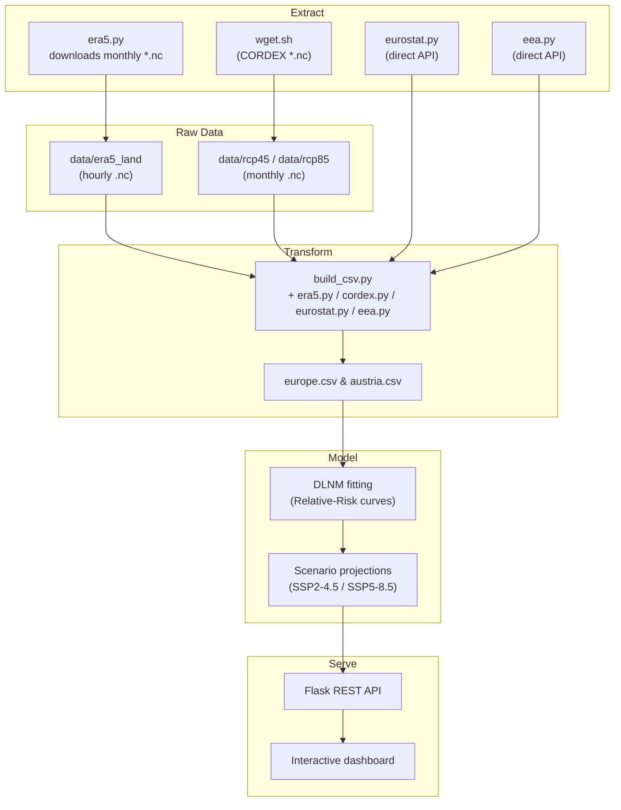

# Data-Pipeline Overview

This document summarises how external datasets flow through the repository, from raw downloads in `data/` to the analysis products served by the Flask application.

---

## 1 . High-level diagram



---

## 2 . Stage descriptions

| Stage        | Folder(s) in repo                                                                                          | Main tools                      |
| ------------ | ---------------------------------------------------------------------------------------------------------- | ------------------------------- |
| **Download** | `scripts/era5.py`, `data/rcp/wget.sh`,                                                                     | `cdsapi`, `wget`, `requests`    |
| **Process**  | Done by `scripts/build_csv.py` and stored in `data/europe.csv` and regional csv files                      | `xarray`, `pandas`, `geopandas` |
| **Model**    | `ccee/rr_curve.py`                                                                                         | `statsmodels`, `numpy`          |
| **Serve**    | Flask reads pre-computed tables in `data/`; JS front-end (Chart.js + Leaflet) renders map and time-series. | Flask, Folium, Chart.js         |

---

## 3 . Folder tree (current repo)

```text
.
├── data/
│   ├── era5-land/            # raw ERA5 hourly NetCDF files
│   ├── rcp45/               # raw CORDEX RCP4.5 NetCDF files
│   ├── rcp85/               # raw CORDEX RCP8.5 NetCDF files
│   ├── europe.csv          # processed Europe-wide weekly table
│   ├── austria.csv         # processed Austria-wide weekly table
├── scripts/                  # ETL + modelling
└── app.py                    # Flask server
```

---

For more details on each stage, see the following document: [Pipeline Details](pipeline_details.md).

---
